# JustWater

JustWater — iOS-приложение для отслеживания количества выпитой воды за день.

Приложение помогает поставить дневную цель, быстро добавлять воду и другие напитки, смотреть историю, отслеживать, в какие дни цель была достигнута, использовать виджеты и синхронизировать записи с Apple Health.

## English Summary

JustWater is an iOS app for tracking daily water intake.

The app helps users set a daily hydration goal, quickly log water and other drinks, review hydration history, configure reminders, use Home Screen widgets, sync logged intake with Apple Health, and track goal completion over time.

## App Store

JustWater доступен в App Store:

Скачать JustWater⁠

JustWater is available on the App Store:

Download JustWater⁠

## Скриншоты

  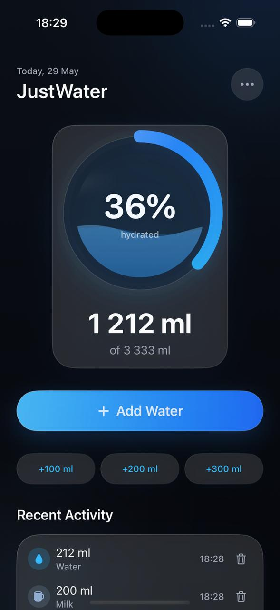
  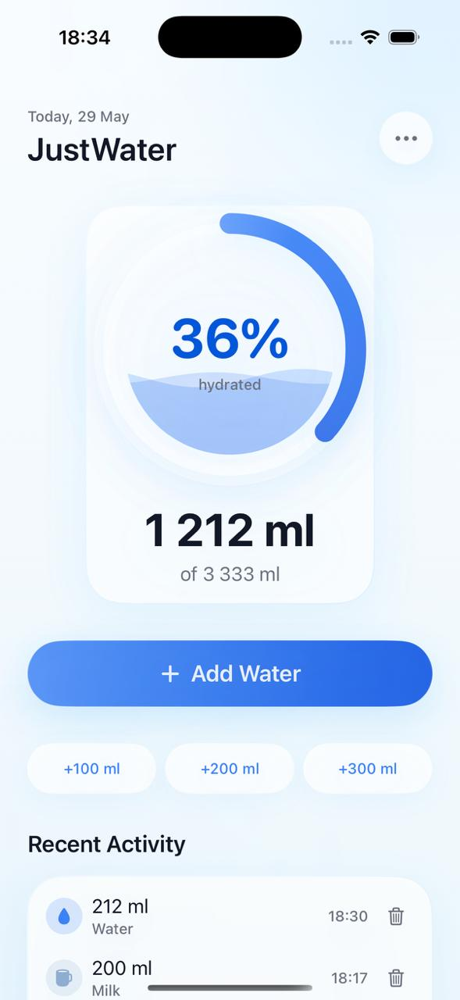
  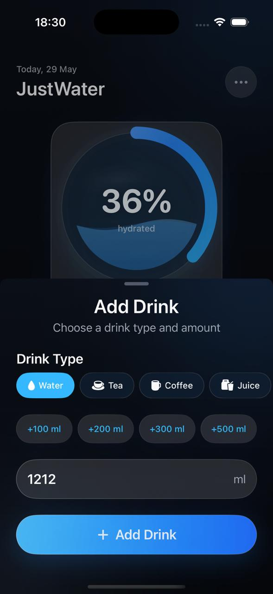

  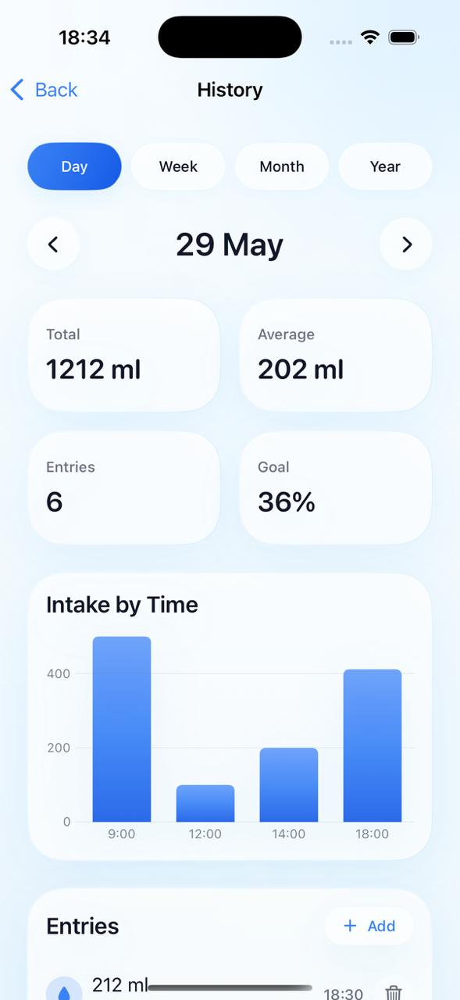
  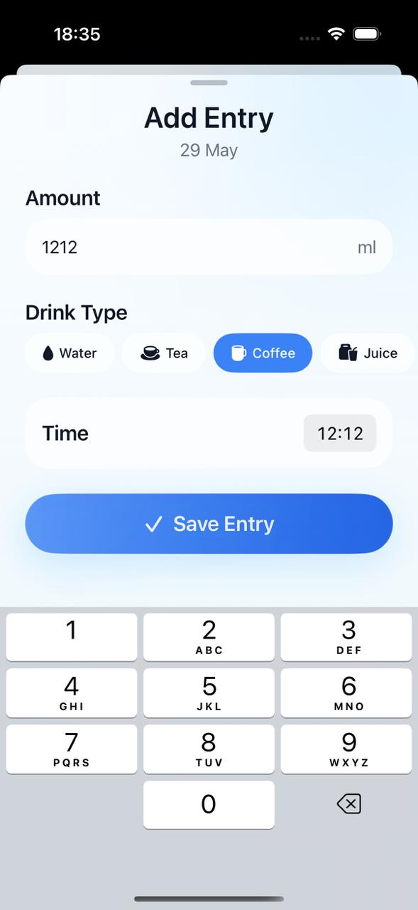
  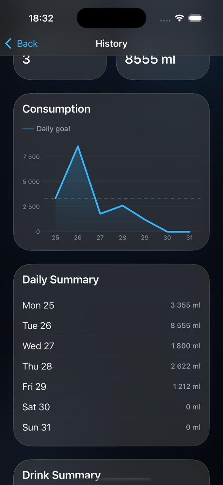

  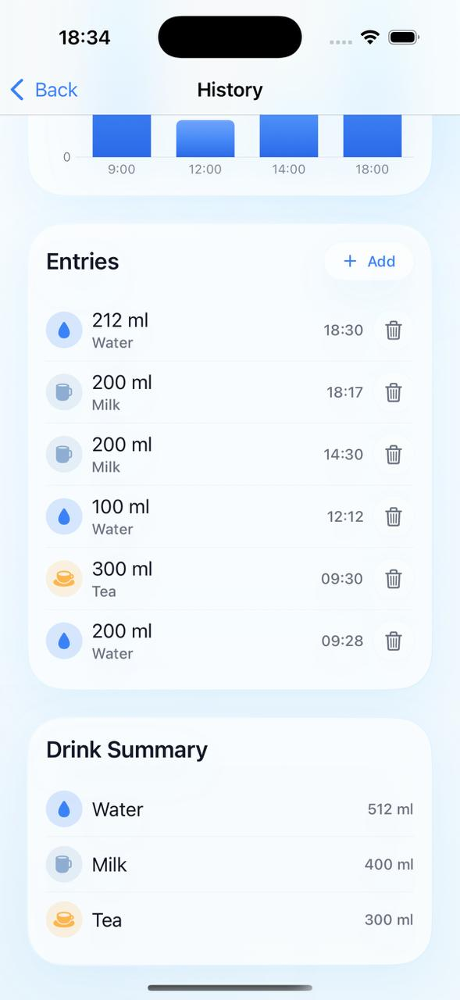
  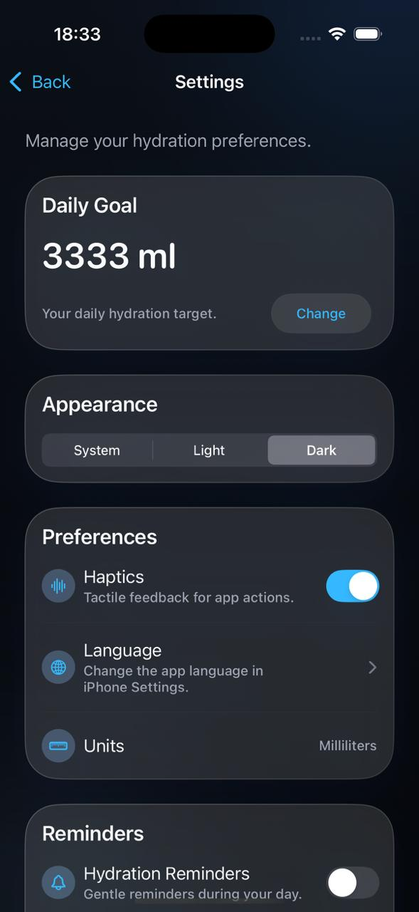
  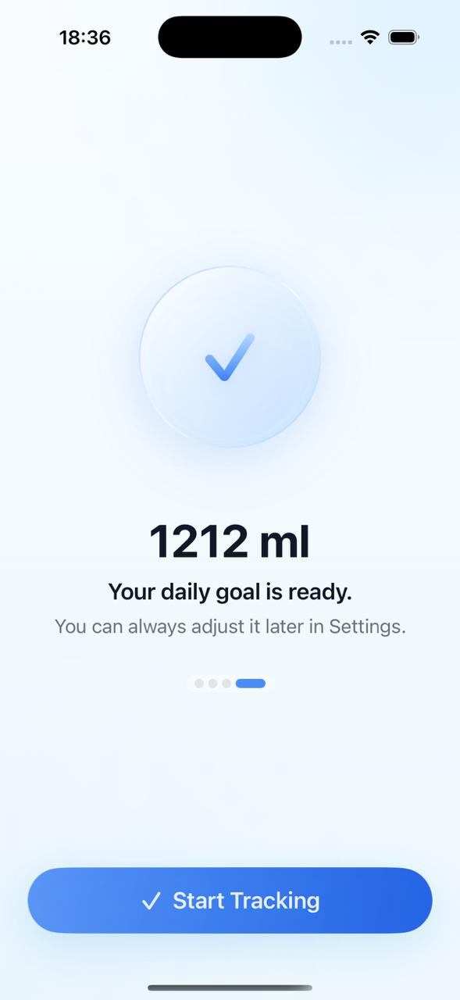

  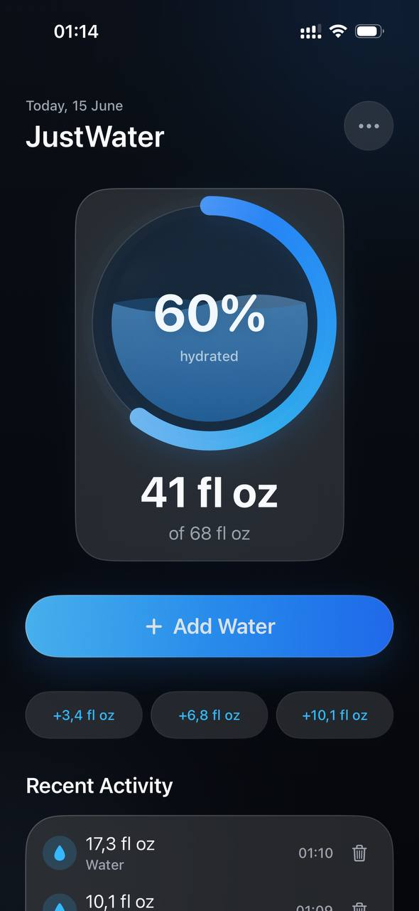
  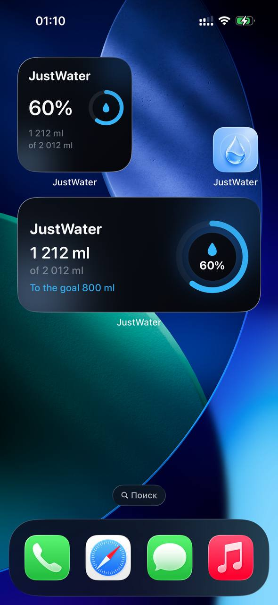
  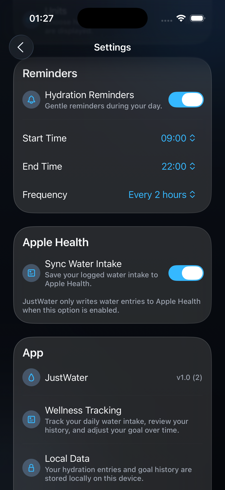

## Что есть в приложении

- добавление воды быстрыми кнопками;
- добавление записи вручную;
- выбор типа напитка;
- поддержка миллилитров и fluid ounces;
- расчёт дневной цели;
- изменение дневной цели;
- история за день, неделю, месяц и год;
- статистика по достигнутым целям;
- текущая серия дней;
- undo для добавления и удаления записей;
- локальные напоминания о воде;
- виджеты на главный экран;
- синхронизация с Apple Health;
- настройки темы;
- настройка haptics;
- onboarding при первом запуске;
- локализация на русский и английский языки..

## Стек

- Swift 6
- SwiftUI
- SwiftData
- Observation
- WidgetKit
- HealthKit
- UserNotifications
- Charts
- OSLog
- XCTest

## Архитектура

- SwiftUI + MVVM
- Feature-first структура
- Dependency Injection через AppFactory
- SwiftData persistence layer
- Unit/integration tests for core business logic

## Requirements

- iOS 17+
- Xcode 26+
- SwiftData

## Note

JustWater предназначен для общего отслеживания привычки пить воду и не является медицинской рекомендацией.
